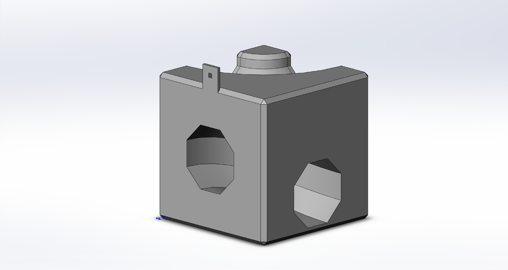

# marble_track #

Parts inspired by Cuboro but designed to be 3D printed.  The repo includes a total of 41 different block designs which can be combined to make 3d marble mazes / tracks.

The base block is a 50mm cube (about 2").  Some blocks are half height and some are much longer runs than 1 block.

## Example Parts ##

Screen shots of block designs.  Note that the CAD files include a small tab used to hang the parts for vapor smoothing after printing.

